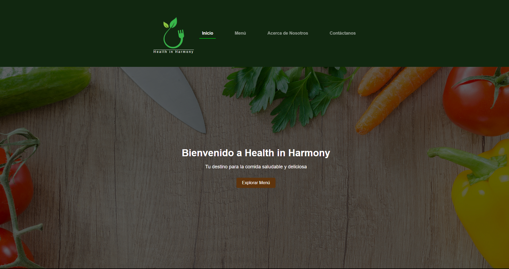
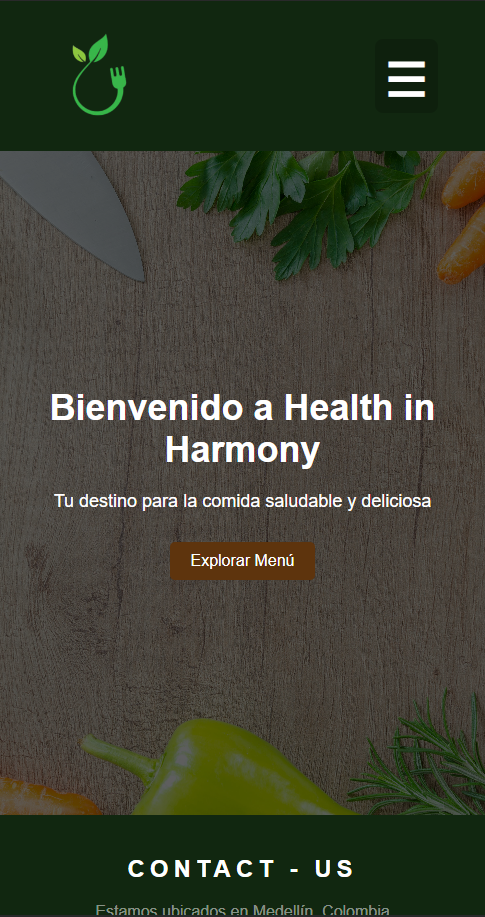
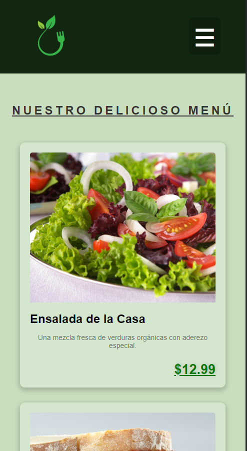
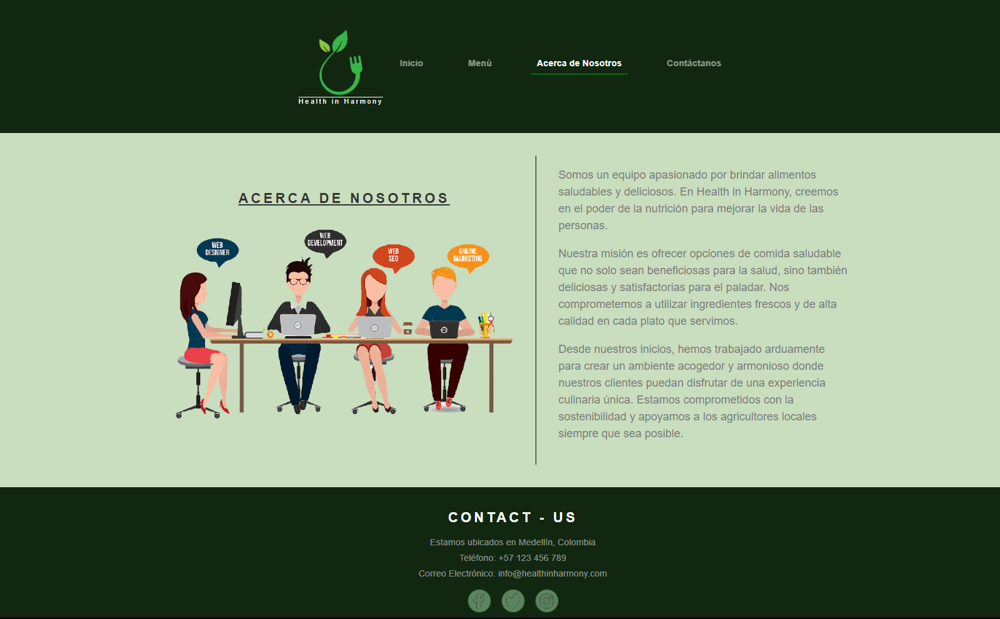
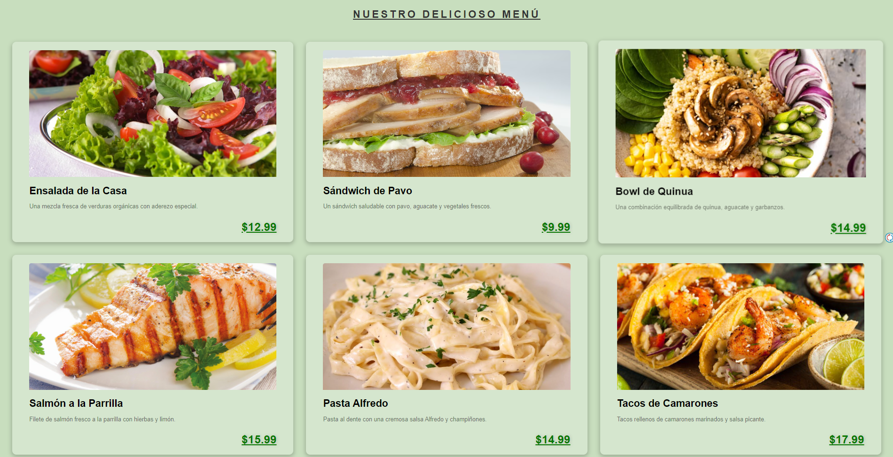
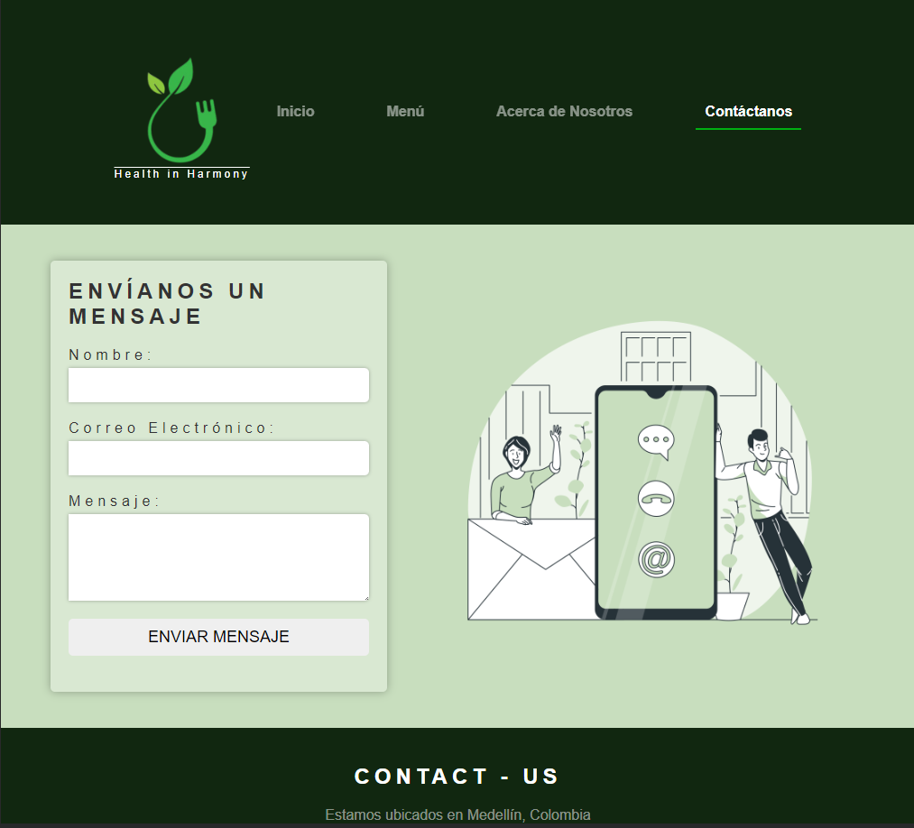

# Health in Harmony 🥑🌿

¡Bienvenido a Health in Harmony! Tu destino para recetas saludables y asesoramiento sobre salud. 🌱.

## 🍏 Acerca de Health in Harmony

En Health in Harmony, nos apasiona promover un estilo de vida saludable a través de recetas nutritivas y consejos expertos sobre bienestar. Creemos que la armonía entre la alimentación y la salud es clave para vivir una vida plena y en equilibrio.

## 🍲 Recetas Saludables

Descubre nuestra colección de recetas saludables, diseñadas para satisfacer tus papilas gustativas y alimentar tu cuerpo con ingredientes frescos y nutritivos. Desde ensaladas coloridas hasta smoothies revitalizantes, tenemos algo para todos.

## 🌐 Asesoramiento Personalizado

¿Buscas asesoramiento personalizado sobre tu salud y bienestar? Nuestro equipo de expertos está aquí para ayudarte. Consulta nuestras guías y artículos informativos sobre temas que van desde la nutrición hasta la actividad física, y encuentra el equilibrio perfecto para tu estilo de vida.

## 📚 Contribuir

¡Nos encantaría contar contigo! Si tienes recetas saludables que te gustaría compartir o consejos sobre bienestar, no dudes en contribuir a nuestro repositorio. Sigue las pautas de contribución en el archivo `CONTRIBUTING.md`.

## 🚀 Comienza

1. Clona este repositorio: `git clone https://github.com/tuusuario/health-in-harmony.git`
2. Explora el código y las carpetas.
3. Comienza a contribuir siguiendo nuestras pautas de contribución.

## 📬 Contacto

¿Preguntas, comentarios o sugerencias? No dudes en ponerte en contacto con nosotros. Envía un correo electrónico a `daniellosada17@gmail.com` o sigue nuestro perfil en [LinkedIn](https://www.linkedin.com/in/daniel-losada17).

¡Gracias por ser parte de la comunidad Health in Harmony! Juntos, construyamos un camino hacia una vida más saludable y armoniosa. 🌟

## -------------------------------------------------------///---------------------------------------------------------------------- ##

# If you're a developer, take at look this ⬇️

## Getting Started with Create React App

This project was bootstrapped with [Create React App](https://github.com/facebook/create-react-app).

## Available Scripts

In the project directory, you can run:

### `npm start`

Runs the app in the development mode.\
Open [http://localhost:3000](http://localhost:3000) to view it in your browser.

### `npm test`

Launches the test runner in the interactive watch mode.\
See the section about [running tests](https://facebook.github.io/create-react-app/docs/running-tests) for more information.

### `npm run build`

Builds the app for production to the `build` folder.\
It correctly bundles React in production mode and optimizes the build for the best performance.

